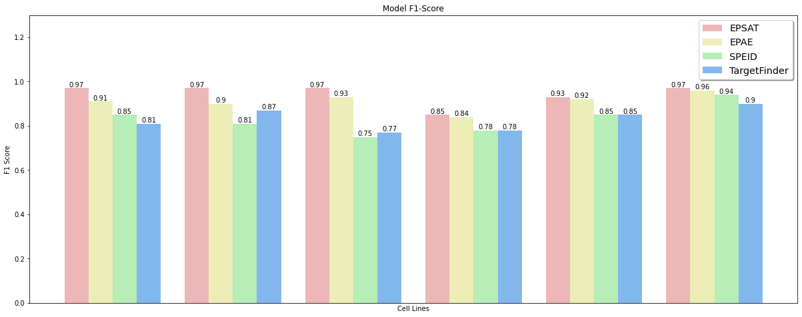

# Using Self-attention Convolutional Features and Auto Encoder to Predict Enhancer-promoter Interactions
## Columbia University COMS W4762 - Machine Learning for Functional Genomics Final Project
### Team: Ziheng Li, Daniel Lee, Thang Nguyen

In biology, transcription is the process of copying DNA into RNA by an enzyme called RNA polymerase in order to regulate gene expression. Specifically, RNA polymerase focuses on transcribing regions of DNA called genes. However, with the human genome having 3.2 billion base pairs long, locating said regions is not trivial. In order to facilitate the process, the enzyme leverages promoters, DNA sequences at the beginning of genes that mark the start of the transcription process. In addition, DNA also contains enhancers sequences, which are located thousands of base pairs away from promoters and contain activator proteins that boost RNA polymerase's efficiency. The interactive property between promoters and enhancers and its tie to gene expression has remained an open question, with many researches focusing on determining the relation between the sequence structures of enhancers, promoters and their interactions. 

In this research, we create __EPSAT__, a deep learning model based on [__SPEID__](https://github.com/ma-compbio/SPEID) (Sequence-based Promoter-Enhancer Interaction with Deep learning) with an enhancement of self-attention approach from [__SATORI__](https://github.com/fahadahaf/satori/), and a novel deep learning beta variational auto-encoder architecture model called __EPAE__. Our results for __EPSAT__ and __APAE__ achieve higher F1 score than __SPEID__ and __TargetFinder__(a model solving the same task using boosted trees algorithms), while having lower count of trainable parameters and epochs. The models can be used for not only to predict EPI in DNA, but also provide a general method  for evaluating the effects of sequence modification in gene expression.

[Presentation](https://www.youtube.com/watch?v=NdwUEqzxbgY)

In order to run the models, please first install all necessary packages in `requirements.txt`.

`pip install -r requirements.txt`

Download dataset used [here](http://genome.compbio.cs.cmu.edu/~sss1/SPEID/all_sequence_data.h5) and put it in the `data/` folder.

Train __EPSAT__ by running: 

`python EPSAT.py`

Train __APAE__ by running:

`python AEClassification/train_VAE.py`
